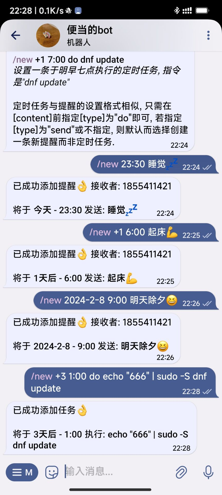

# at_tg_bot

一个与系统at绑定的tg机器人, 可用于任务或提醒

## 效果

## 功能

1. 设置提醒, 时间到时会向设定者或设定群组发送设定消息;
2. 设置任务, 时间到时会自动执行设定好的指令;
3. 支持管理员系统, 只有在管理员列表中的用户或会话才可设置任务;
4. 可列出或清空所有提醒或任务记录;
5. ...

## 使用

`/new {date/future} [time] [type] [content]` 创建一条新的提醒或任务.

示例:

/new +3 8:00 去公园

_设置一条三天后上午八点的提醒, 内容是\"去公园\"_

/new 2024-2-10 19:00 send 吃饭

_设置一条于2024年2月10日傍晚七点的提醒, 内容是\"吃饭\"_

/new 23:30 睡觉

_设置一条于今日晚11点半的提醒, 内容是\"睡觉\"_

/new +1 7:00 do dnf update

_设置一条于明早七点执行的任务, 指令是\"dnf update\"_

任务与提醒的设置格式相似, 只需在[content]前指定[type]为\"do\"即可, 若指定[type]为\"send\"或不指定, 则默认而选择创建一条新提醒而非任务.

---

`/ai [word]` 和青云客AI对话(不是很智能但是免费)

---

`/list` 指令列出当前所有提醒或任务.

---

`/clear` 清空所有提醒或任务记录.

---

`/sudo [do] [ID]` 添加或移除一位管理员.

示例: 

/sudo add 123456

_设置ID为123456的用户或会话为管理员_

/sudo rm 123456

_移除ID为123456的用户的管理员身份_

[do]参数共有`add(添加)`和`rm(移除)`两个, [ID]则为用户或会话的ID, 可输入 /id 查看自己或当前会话的ID.

---

`/id` 获取自己或当前会话的ID.
